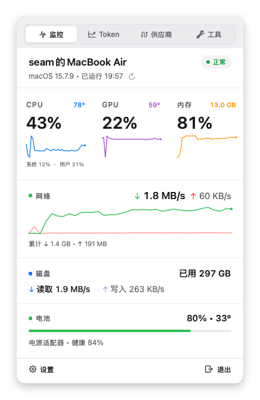
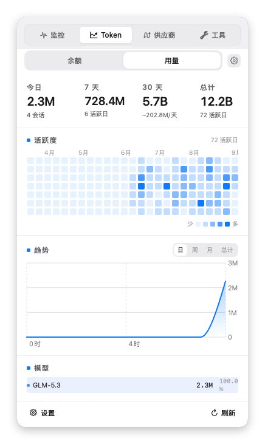
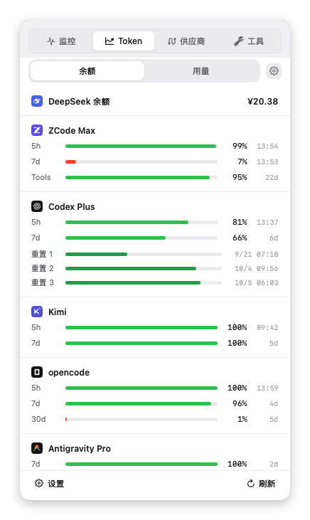
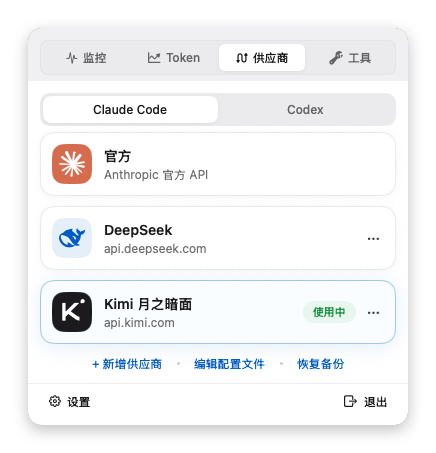
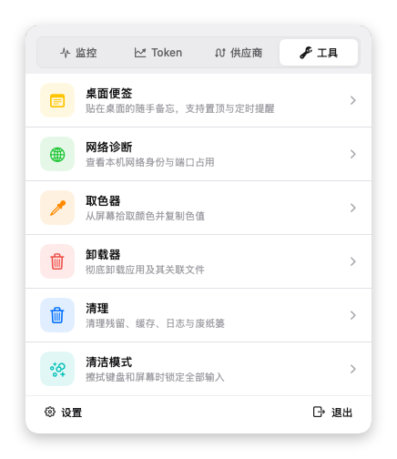
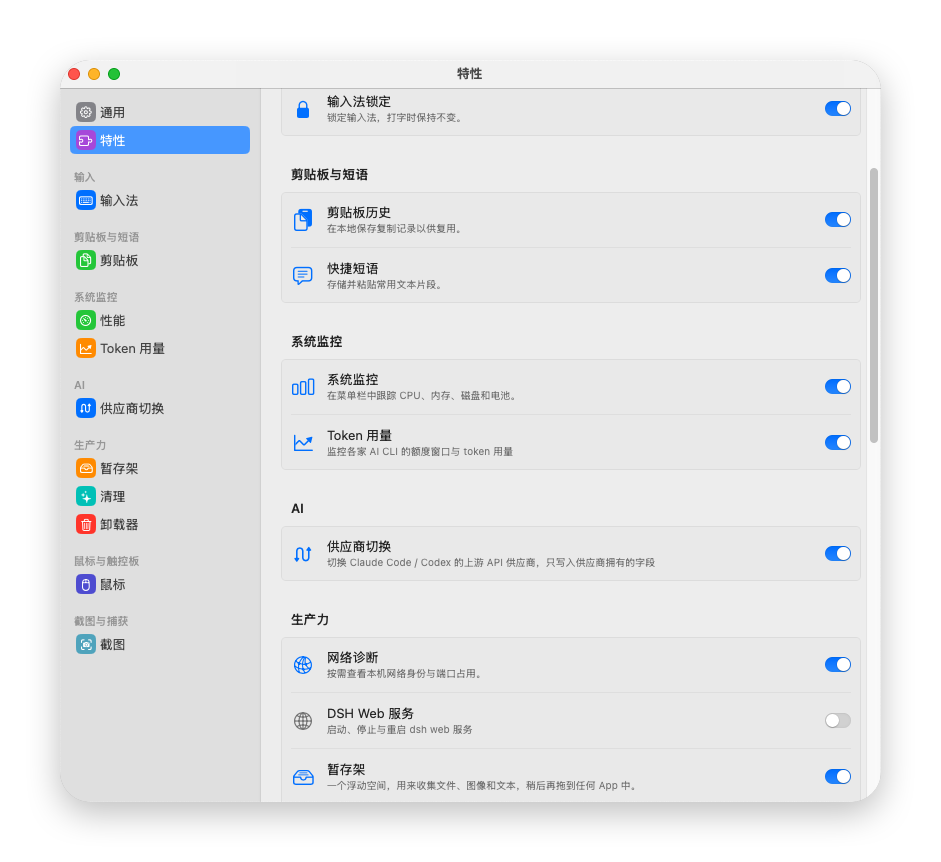

<div align="center">
  

# OmniForge

**A modular macOS menu-bar toolkit** — input method lock, clipboard history, screenshots, system monitoring, AI CLI token tracking, and everyday utilities.

[](https://github.com/seam95/OmniForge/actions/workflows/ci.yml)
[](https://github.com/seam95/OmniForge/releases)
[](LICENSE)


[English](./README.md) · [中文](./README_zh.md)

<br>

&nbsp;&nbsp;&nbsp;&nbsp;

&nbsp;&nbsp;

<br>



<sub>The Feature Hub — install only what you need, grant permissions per feature</sub>

</div>

## ✨ Features

OmniForge lives in the menu bar and grows with you: enable features individually from the **Feature Hub**, grant permissions per feature, and keep the menu bar uncluttered.

### 📊 System Monitor

- **Monitor panel** — CPU, GPU, memory, temperature, network, disk, battery, and process rankings at a glance.
- **Menu bar metrics** — Choose which metrics stay visible, with layout and alert options.
- **Alerts** — Threshold notifications for CPU, temperature, memory, disk space, and battery.

### 🤖 AI tooling

- **Token Usage** — Track token spend and quota windows (5-hour / 7-day resets, subscription balance) across a dozen-plus AI CLIs — Claude Code, Codex, Cursor, Qoder, Trae, Kimi, Grok, OpenCode, Zcode, Antigravity, and more — with usage alerts and reset reminders.
- **Provider Switch** — One-click switching of API providers / relay profiles for Claude Code and Codex from the menu bar; configs are backed up before every switch and can be restored.

### 🧰 Productivity

- **Sticky Notes** — Colorful sticky notes pinned to your desktop for quick capture.
- **Shelf** — Park files, images, links, and text, then drag them into another app later.
- **Cleaner** — Scan leftovers, caches, logs, and other junk; confirm before cleaning.
- **Cleaning Mode** — Lock all input while you wipe your keyboard or screen.
- **Uninstaller** — Find an app and its related support files, then move them to Trash after confirmation.
- **Color Picker** — Sample a screen color and copy HEX / RGB / HSL.
- **Network Diagnostics** — Local network identity, public IP, and listening ports with process info.

### ⌨️ Input

- **Input Method Lock** — Pin an input source per workflow and keep it from flipping mid-typing.

### 📋 Clipboard

- **Clipboard History** — Local history for text, images, files, links, and rich text; search, filter, and paste again.
- **Quick Phrase** — Save, edit, and paste reusable text snippets.

### 📸 Capture

- **Screenshot** — Region / fullscreen capture with annotation tools, pin-to-screen, and related capture workflows.

### 🔋 Energy

- **Keep Awake** — Prevent sleep for a duration or indefinitely; optional clamshell (lid closed) stay-awake support where the Mac allows it.

### 🖱️ Mouse & trackpad

- **Scroll Inverter** — Invert mouse wheel scrolling while keeping trackpad natural scroll.
- **Smooth Scroll** — Turn discrete mouse wheel steps into smoother scrolling.
- **Mouse Navigation** — Map side buttons to back / forward.
- **Dock Click** — Minimize, restore, or cycle windows from the Dock icon.

### ⚙️ System & experience

- Launch at login, optional hide Dock icon
- Onboarding, permission portal, and Feature Hub
- Languages: Simplified Chinese, English, or follow system

## 📦 Requirements

- **macOS 14** or later
- To build from source: Xcode 16+ or a matching Swift toolchain with command-line tools (`swift`, `actool`, `codesign`)

## 🚀 Install

### From Releases

1. Open [Releases](https://github.com/seam95/OmniForge/releases).
2. Download the latest `.dmg`.
3. Move **OmniForge** into **Applications** — do **not** launch it yet.
4. Remove the quarantine attribute, then launch it and grant the permissions the app requests for the features you enable (see below).

> ⚠️ **Signing & Gatekeeper notice**
>
> Releases are **ad-hoc signed and not Apple-notarized** (this open-source project does not yet hold a Developer ID). macOS will block the first launch. After dragging `OmniForge.app` into `/Applications`, run this in Terminal before opening it:
>
> ```bash
> sudo xattr -dr com.apple.quarantine /Applications/OmniForge.app
> ```
>
> Because it is not notarized, macOS may occasionally require you to re-grant system permissions. This is an inherent limitation of unsigned distribution — please understand before downloading.

### Build from source

```bash
git clone https://github.com/seam95/OmniForge.git
cd OmniForge
swift build
./build.sh
open build/stage/OmniForge.app
```

- `./build.sh` assembles a signed `.app` (Developer ID or Apple Development when available, otherwise ad-hoc).
- `./build.sh --install` installs into `/Applications`.
- `./build.sh --dmg` produces a distributable `.dmg` under `build/stage/`.

## 🔐 Permissions

Permissions are requested **per feature**, not all at once:

| Permission | Typical features |
|------------|------------------|
| Accessibility | Input Method Lock, mouse tools, optional Keep Awake pointer jiggle |
| Input Monitoring | Some input-related flows when enabled |
| Screen Recording | Screenshot |
| Full Disk Access | Cleaner, Uninstaller |
| Notifications | System Monitor alerts, Keep Awake (optional) |

Clipboard history, Quick Phrase, Shelf, Color Picker, and Network Diagnostics need little or no special privacy access for basic use. Use **Settings → permissions / Feature Hub** inside the app for the live status of each feature.

## 🛠 Development

Short overview:

- **UI** (`Views/`) — SwiftUI; subscribe to state and send intents only
- **Services** — one manager per concern, constructor injection
- **System** — macOS APIs behind protocols for testability

```bash
# Debug build
swift build

# Assemble .app
./build.sh

# Unit tests (XCTest; required flag with current toolchain)
swift test --disable-swift-testing
```

See [CONTRIBUTING.md](CONTRIBUTING.md) for architecture notes, style, and PR expectations.

### Dependencies

Managed via [`Package.swift`](Package.swift):

- [GRDB.swift](https://github.com/groue/GRDB.swift) — local SQLite
- [KeyboardShortcuts](https://github.com/sindresorhus/KeyboardShortcuts) — global shortcuts

## Contributing

Issues and pull requests are welcome. Please read [CONTRIBUTING.md](CONTRIBUTING.md) before opening a PR.

## License

[MIT](LICENSE)
